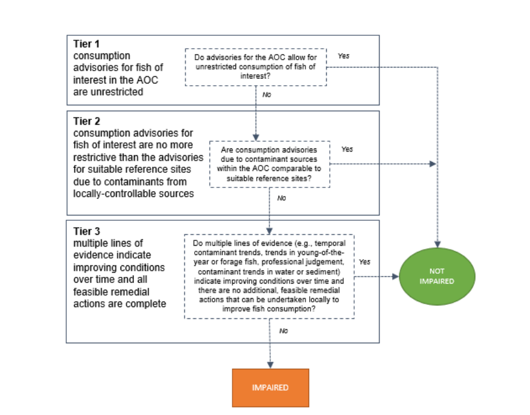

# (PART\*) Tiered Assessment Approach for Criterion 1.1 {.unnumbered}

# Methods {#methods}

## Generic criteria {#methods-criteria}

In 1991, the IJC recommended the Fish and Wildlife Consumption BUI delisting guideline:

*"When contaminant levels in fish and wildlife populations do not exceed current standards, objectives or guidelines, and no public health advisories are in effect for human consumption of fish or wildlife. Contaminant levels in fish and wildlife must not be due to contaminant input from the watershed."* [@ijc1991]

In the following decades, the original delisting guideline from 1991 proved inadequate for assessing this BUI. Though contaminant concentrations in fish have improved in AOCs since these delisting guidelines were proposed [@bhavsar2018], advisories remain in place throughout the Great Lakes because the contaminants of concern are more toxic and persistent than previously thought [@bhavsar2018]. To rectify the inconsistencies among AOCs in addressing this BUI, @bhavsar2016 utilized the following delisting statement in the Toronto and Region AOC's BUI 1 Assessment Report:

*“Consumption advisories for fish of interest in the AOC are unrestricted or no more restrictive than the advisories for suitable reference site(s) due to contaminants from locally-controllable sources.”*

In 2018, Bhavsar recommended the delisting criterion be used as a generic delisting criterion for BUI 1 among Canadian AOCs [@bhavsar2018]. In 2020, following reviews by the RAP team, the NR RAP adopted the following delisting criteria for BUI 1:

1.  *"Consumption advisories for fish of interest in the AOC are unrestricted; OR"*

2.  *"Consumption advisories for fish of interest are no more restrictive than the advisories for suitable reference sites due to contaminants (PCBs and dioxin-like PCBs) from locally-controllable sources; OR"*

3.  *"Multiple lines of evidence indicate improving conditions over time and all feasible remedial actions are complete."*

These criteria are assessed through a tiered assessment framework, utilizing multiple lines of evidence to set out an order to which to assess the impairment of the BUI. Based on the outcome of each tiered evaluation, a recommendation is made to either maintain the "Imparied" BUI status or to pursue the redesignation of the BUI to "Not Impaired" given the evidence used in the assessment framework.

## Tiered assessment framework {#methods-tiered-framework}

The tiered assessment framework, as adapted for use in the Niagara River AOC, comprises 3 tiers, each compiling different evidence lines to determine if delisting criterion 1.1 is met (Figure \@ref(fig:tiered-framework-fig)):

Tier 1: Consumption advisories for fish of interest in the AOC are unrestricted

Tier 2: Consumption advisories for fish of interest are no more restrictive than the advisories for suitable reference sites due to contaminants from locally-controllable sources

Tier 3: Multiple lines of evidence indicate improving conditions over time and all feasible remedial actions are complete

The framework is designed such that if all fish of interest in the AOC pass a particular tier, the delisting criterion can be said to be met. Otherwise, analysis moves to the next tier. If all tiers are failed, then the delisting criterion cannot be said to be met. It should be noted that, in the Niagara River AOC, the primary contaminants of concern are polychlorinated biphenyls (PCBs). Thus, analyses of contaminants are limited strictly to the sources and concentrations of PCBs in AOC fish.

(ref:tiered-framework-fig) Modified tiered assessment framework applied in the 2025 BUI 1 Assessment for the Niagara River AOC. Adapted from @drouillard2022.

```{r tiered-framework-fig, echo = FALSE, fig.cap="(ref:tiered-framework-fig)"}

```

Since the previous BUI 1 Assessment Report in (year) (reference), the Guide to Eating Ontario Fish has been updated with new fish contaminant data (which was collected on an annual basis, excluding 2020 due to the Covid-19 pandemic [could use citation - Melissa]) where available, including collections of targeted species (such as walleye and yellow perch) following recommendations from the report. Furthermore, a combination of angler surveys and scientific publications were used to assess the BUI in terms of community desired consumption rates of fish of interest, rather than using MECP definitions of restrictive consumption advice (MECP, 2025). These new data were used to make up-do-date comparisons of fish consumption advisories within the AOC and reference areas in the Lake Erie and Lake Ontario. Below is a summary of each tier, and the methods for which they are evaluated.

### Tier 1: Comparison of AOC Fish Consumption Advisories to Desired Consumption Rates {#methods-tier1}

The first step of the tiered framework provides a coarse screening of whether fish consumption advisories in the AOC are restrictive in relation to locally desired consumption rates. Given that virtually all fishing zones in Ontario have some fish consumption restrictions in place, there is a need to define a benchmark for the degree of restrictiveness that is considered non-restrictive relative to the normal consumption patterns of fish in a given waterbody by the local community. Advisory values, expressed as the number of meals per month recommended for the general and sensitive population groups, were compiled from the Guide to Eating Ontario Fish, published by the Ontario Ministry of the Environment, Conservation and Parks (MECP; see Section \@ref(mecp-advisory-data)). These advisories are based on contaminant concentrations measured in fish flesh and translated into species- and size-specific consumption categories using contaminant thresholds (Table \@ref(tab:methods-contam-thresholds)).

(ref:methods-contam-thresholds) MECP fish consumption advisory contaminant benchmarks (adapted from @bhavsar2016). Contaminant concentration values correspond to advised maximum monthly fish meals. Mercury consumption advisories are issued separately for the general population and sensitive population (children under 15 years old and anyone who is pregnant or may become pregnant).

```{r methods-contam-thresholds-cap, echo=FALSE, results='asis'}
is_html <- knitr::is_html_output()
  if (is_html){
tbl_caption("methods-contam-thresholds")
  }
```

```{r methods-contam-thresholds, tab.cap = '(ref:methods-contam-thresholds)', echo = FALSE}
contam_thr_ft

```

Advisory values for each fish of interest in the AOC were then compared against a benchmark representing acceptable levels of consumption, determined by the results of the community survey (see Section \@ref(methods-survey)). Any advisory below this benchmark was considered restrictive, while those at or above the benchmark were considered non-restrictive. This step provides a baseline indication of potential impairment and allows the RAP team to identify species or size classes where consumption guidance is most restrictive, independent of regional comparisons. Additionally, Tier 1 excludes unrestricted fish from further analysis, since these species meet the delisting criteria at its most basic level. If all species pass Tier 1, delisting criterion 1.1 can be said to be met. Tier 1 uses a strict passing benchmark, where any number of restrictive size categories in either population type (General or Sensitive) will cause a species to fail and move to Tier 2.

### Tier 2: Comparison of AOC Advisories to Reference Sites {#methods-tier2}

Tier 2 assesses whether the fish consumption advisories for fish of interest in the AOC are comparable to those at suitable reference sites. If all the restrictive advisories for a given species in the AOC are less restrictive or equivalent to those in reference sites, the species passes Tier 2. Otherwise, the assessment of failing species moves to Tier 3. Similarly to Tier 1, Tier 2 uses official consumption advice provided by MECP. Species that passed Tier 1 assessment were excluded from Tier 2 analysis. Furthermore, size classes that pass Tier 1 within a species were excluded from Tier 2 analysis.

The advisory values for each species of interest, at each reported size class, in the AOC are compared to the median value of advisories for reference sites. Tier 2 reference sites are selected as those representative of a broad measure of background intensity of advisories across a comparable geographic region. That is, reference sites are characterized as a broad geographical representation of the region that are removed from AOC sources of legacy contamination rather than selecting for pristine, undisturbed waterbodies or areas with similar ecology. Furthermore, reference sites need to have fish consumption advisories available for the selected species of interest as well as overlapping size ranges of each species with that of the AOC. For this analysis, we selected all non-AOC, open-water fishing zones in Lake Erie as comparisons for the Upper Niagara River (Lake Erie to the top of the Niagara Falls) and Lake Ontario as comparisons for the Lower Niagara River (from the bottom of Niagara Falls to Lake Ontario) for which consumption advice is issued for the same species of interest in the AOC. The AOC fishing zones excluded were Toronto Waterfront and Hamilton Harbour. Furthermore, tributaries, embayments, and harbours were excluded, as they generally do not encapsulate background conditions of the geographical region.

To compare the intensity of advisories, we compared the advisory value for each species and size class, each for the General and Sensitive populations, for available species of interest in the AOC (below the Tier 1 benchmark) to the median of reference advisories for which advisories were issued for the same species. Because meal/month consumption advisories are issued in discrete categories (see Section \@ref(mecp-advisory-data)), reference median values were rounded up to the next advisory value when there were an even number of reference sites (and the true median would therefore fall between advisory categories). For example, a median advisory value of 10 meals/month would be rounded up to 12 meals/month. This is because the median of an even number of sites would fall between two advisory categories (e.g., the median between 8 and 12 is 10). While this does not change the outcome of the analysis, it is a clearer representation of official consumption advice. AOC advisory values below the desired consumption benchmark (e.g., 8 meals/month) are compared to their respective reference medians, and those size categories equal to or above the reference median pass Tier 2 assessment, while those below the reference median fail Tier 2. Similarly to Tier 1, Tier 2 adopts a strict benchmark, where any number of size categories for either population type will cause a species to fail and move to Tier 3.

### Tier 3: Weight of Evidence Approach {#methods-tier3}

Tier 3 evaluates the status of the BUI using a weight of evidence approach, which considers multiple lines of evidence pertaining to fish contaminant concentrations in the AOC and reference areas. As with previous tiers, species are evaluated independently. However, the nuanced nature of the weighted evidence approach means that a single pass/fail metric for each species is inappropriate at this tier. The outcome of the weight of evidence available will be used to support or not support redesignation of the BUI. Tier 3 evidence lines are determined in aggregate, meaning that unlike the decision tree between tiers, all sub-categories of Tier 3 are considered jointly regardless if a species passes or fails one or more evidence lines. We considered the following lines of evidence for Tier 3:

#### Tier 3A: Virtual advisory {#methods-t3a}

Tier 3A seeks to address the relationship between priority contaminants in the AOC and fish consumption advice. Because fish consumption advisories consider multiple fish contaminants, and are issued based on the strictest restriction from any contaminant (cite), it is important to isolate the effect of priority AOC contaminants on driving local fish consumption advisories. Additionally, in some cases, official advisories may be based on data that dates as far back as the 1970s. Thus, it is important that restrictions on fish consumption are considered using more recent data to account for restorative effects in the AOC associated with previous remedial actions. To achieve this, "virtual advisories" are created using the same fish contaminant data and methods used by MECP to generate official consumption advice. Fish contaminant data (obtained from MECP, see Section \@ref(mecp-contam-data)) is filtered to the contaminant of concern (mercury) and the previous 10 years of data (2014 and more recent), and this data is used to calculate virtual advisories using the MECP method.

Virtual advisory values were generated by modelling the relationship between fish length and contaminant concentration. For each region (AOC and reference), the function fits a log-log linear model (lm(log(Value) \~ log(Length)) to evaluate whether a significant relationship exists (p ≤ 0.05). If so, predicted concentrations are generated across a continuous length range (from smallest to largest observed value), and then averaged within fixed 5 cm fish length bins. Advisory levels are assigned using MECP-defined contaminant- and population-specific (General/Sensitive population) thresholds to the mean predicted concentrations. If no significant relationship is detected, advisory levels are based on the mean concentration of all observations within each fish length interval. If any size categories of the virtual advisory are restrictive compared to the desired consumption rate and to reference values, Tier 3A assessment is unsupportive of delisting for this species. Virtual advisories are not to be used as a replacement for official consumption advice and are limited strictly to the evaluation of this BUI.

The virtual advisories in this tier are evaluated similarly to Tiers 1 and 2; i.e. first it is determined if virtual advice for any size categories is restrictive compared to the community desired consumption rate (see Section \@ref(methods-tier1)), then if virtual advice for any size category are more restrictive than suitable reference sites. Similarly to Tiers 1 and 2, any number of restrictive size categories are considered a failure for Tier 3A.

#### Tier 3B: Comparisons of fish contaminants in the AOC vs Reference {#methods-t3b}

To determine the degree of contamination in fish in the AOC by priority contaminants, the concentrations of mercury in fish tissue were compared between the AOC and suitable reference sites.

Reference sites for Tier 3B differ from those used in Tier 2 in that the MECP fish collection zones do not correlate directly with the zones used in the official advisories. For example, one official advisory zone (as is used in Tier 2) may comprise several collection areas. For Tier 3B, reference zones are similarly limited collections zones in the upper St. Lawrence River (upstream of the Moses-Saunders Dam) and Lake Ontario not influenced by AOC mercury sources for which collections of the evaluated species have occurred within the most recent 10 years of study (2014-2024). Since Tier 3B is limited to assessing mercury contamination, AOC fishing zones may be used as reference sites if the associated legacy contaminants are organic rather than mercury. For instance, the Bay of Quinte was used as a reference area where data were available, since the contaminants of concern in this AOC are PCBs, dioxins, and furans; there is no legacy industrial source of mercury in the area. The number and locations of reference sites may differ between species depending on the availability of data.

To assess differences in fish contamination between the AOC and reference sites, contaminant–length relationships were modeled using Generalized Additive Models (GAMs), allowing for non-linear associations. For this model, length was first log-transformed to control for skewed data distributions (contaminant-length relationships are often exponential), which was used as a fixed smooth effect along with region (AOC or reference), with collection area as a random effect to control for site-specific confounding variables. For each species of interest, we first tested whether the shape of the concentration–length relationship differed significantly between AOC and reference fish by comparing the full model to a null model with reduced terms using ANOVA. Where models supported statistically similar trends (non-significant interaction), we compared size-adjusted contaminant levels using estimated marginal means. Where shapes differed significantly, contaminant concentration values were compared by GAM-predicted values across the range of lengths of each fish species at 5 cm intervals. A threshold of α = 0.05 was used to evaluate statistical significance throughout.

Where contaminant-length relationships differed between AOC and reference, Tier 3B can be considered supportive of redesignation when the majority of size classes do not significantly differ in predicted contaminant concentration between AOC and reference. Where the contaminant-length relationship does not significantly differ, Tier 3B can be considered supportive of redesignation when the marginal mean of contaminant concentration does not significantly differ between AOC in reference. Otherwise, Tier 3B is considered not supportive of redesignation.

#### Tier 3C: Temporal trends of contaminants in fish {#methods-t3c}

In Tier 3C, we evaluated the direction of trends in contaminants through time, and make predict how these trends will continue into the future. Temporal trends in mercury concentrations in AOC fish of interest were assessed using generalized additive mixed models (GAMMs) across all years of data. Log-contaminant concentration was modeled with a log-linear fixed effect for sample year to assess the temporal trends on an exponential scale, a smooth fixed effect for log-length to account for differences in contaminant concentration across fish length, and a site smooth random effect to account for regional differences in sampling and other confounding variables. The slope (on log scale) represents the annual rate of change in mercury concentration, defined as k = -slope (such that k \> 0 indicates a decline, and k \< 0 indicates an increase in contaminant concentration). Standard errors are obtained via the delta method. This model allows us to determine if contaminant trends are stable, increasing, or decreasing over time. If contaminant concentrations are stable or increasing, Tier 3C is unsupportive of delisting. If contaminant concentrations are decreasing, we use the model to predict future trends in contaminants.

Using this decay model, we estimated the time required to reach a nonrestrictive monthly meal allowance for sensitive populations for the median, upper quartile, and lower quartile fish lengths (rounded to the nearest 5 cm). Generally, community survey and MNR creel survey results indicated that the lower, median, and upper quartiles of fish lengths approximately correspond to the range of fish lengths consumed by most anglers in the AOC. The half-life of contamination in each species was derived from the fitted yearly slope of log-transformed concentrations in the GAMM. If concentrations are increasing, a doubling time is reported instead. To estimate time to unrestrictive advisory threshold, predictions were anchored at the most recent observed year and a representative length (upper quartile rounded to the nearest 5 cm), and the model assumed a continuous rate of change using the half-life estimate. The model projects the expected time required for contaminant concentrations of upper-quartile-length fish to fall below the restrictive benchmark established in Tier 1 for the sensitive population. For instance, if the desired consumption rate of a species is 8 meals per month, the threshold for the sensitive population would be 0.16 µg/g mercury (Table \@ref(tab:methods-contam-thresholds)). A timeline of 10 years or fewer is considered supportive of delisting, whereas a timeline of 10 or more years is unsupportive of delisting for this species. This estimate supports the temporal assessment of Tier 3C by forecasting how long the BUI will remain impaired in the absence of additional remedial actions.

### Tier 4: Legacy Sources of Mercury in the AOC

Tier 4 assessment, like Tier 3, uses several evidence lines to determine support for delisting the BUI. Tier 4 expands the scope from fish to the environment, assessing the history and impact of past remedial actions on environmental recovery and fish contamination, as well as identifying potential future actions. Using a combination of literature review, monitoring data, and ecological metrics, available data is weighed in relation the restoration actions identified in the Stage 2 and draft (unpublished) Stage 3 RAP reports, as well as the degree of completion of these actions. Data may include contaminant concentration and track-down studies in the water, sediments, young of year (YOY) forage fish, and benthic invertebrates within the AOC and tributaries. Tier 4 may also include modelling approaches to relate environmental conditions to fish contaminants, including mercury isotopic tracer studies to determine the sources and movement of mercury into the food web.

(This section to be expanded in future)

## Community fish consumption survey {#methods-survey}

To properly address the needs of the community surrounding the AOC through this BUI assessment, it is important to understand the the impact of the BUI on the consumption habits of the community. By asking the community about consumption habits, we can identify a list of species of interest in the AOC, how often these species are being consumed, and at what portion sizes. This information can help use assess the degree of impairment caused by fish consumption restrictions in the AOC.

For this BUI assessment, surveys from the following sources were used to determine species of interest and local consumption habits: the Niagara Peninsula Conservation Authority (NPCA; online 2019-2021, n = 157; and in person 2020-2021, n = 237), Missisaugas of the Credit First Nation (MCFN; 2019, n = 44), Six Nations of the Grand River (SN; year, n = 50), and the Metis of Ontario (MNO; year, n = 629). To preserve data sovereignty and privacy of the survey respondents, the summary results were anonymized and pooled for the purposes of this assessment. Respondents were asked about fish consumption habits in the AOC, and in some cases, surrounding areas. Summaries of responses to questions about whether or not the respondents eat fish caught from the AOC, the species they eat, the average consumption frequency of each species, and the average portion size of a fish meal were used. The associated reports for each survey are attached in the Appendix.

Since survey data was used from different sources, it was not always possible to retain exact parity between responses. Survey questions differed in how they asked about where respondents fish and how often they eat each species. For instance, the MNO survey asked respondents about fishing habits in Lake Erie and Lake Ontario separately, and separate questions about a) whether respondents fish in the AOC, and b) whether consumption habits are different in AOCs versus other locations. As the NR AOC was included under "Lake Ontario" for this survey, summary data from this section was used for this assessment. Similarly, the SN survey asked a subset of fishers that consume fish in the NR AOC which species are caught and consumed there, so summary data for these species were used in this assessment. Additionally, consumption frequency questions (eg, "Once a week", "2-3 times per week", "3-6 times per month") differed between surveys, so these were standardized into categories as displayed in Table \@ref(tab:survey-conversion-rate). Two of the surveys subsetted some species into family groups that may be easier for respondents to identify (perches, basses, salmonids, pike, catfish, and panfishes), so the consumption frequencies for each of these categories were applied to all species that appear in the Guide to Eating Ontario Fish within them (eg, consumption frequency of "basses" is applied equally across smallmouth and largemouth bass).

Responses from these surveys were used to establish the community's restrictive consumption threshold for each species using several methods: First, species of interest are defined as those consumed by at least 5% of survey respondents who eat fish. Second, a weighted average for meal frequency was calculated by multiplying the number of respondents by their current monthly consumption rate (converted from survey response options to monthly meal equivalents, see Table \@ref(tab:survey-conversion-rate)), then dividing by the total number of respondents that eat this species. Third, a weighted average meal size was calculated similarly to frequency, with survey response options converted to monthly meal equivalents as per Table \@ref(tab:survey-conversion-portion). In these surveys, average portion size was estimated across species, as there were no species-specific questions for portion size. Finally, the weighted average frequency was multiplied by the weighted average portion size to get an average desired consumption rate, which was rounded up to the next advisory category for the Sensitive population (0, 4, 8, 12, 16, or 32 meals per month).

(ref:survey-conversion-rate) Survey response conversion table for desired consumption frequency.

```{r survey-conversion-rate, tab.cap ='(ref:survey-conversion-rate)', echo = FALSE}
rates_resp = c("Rarely (<1/month)", "Once a month", "Once a week", "2-5 times a week", "Daily")

rates_conv = c(0.5, 1, 4, 16, 32)

conv_rate = data.frame(rates_resp, rates_conv)

conv_rate = conv_rate %>%
  rename("Consumption Rate (Survey)" = rates_resp, "Conversion" = rates_conv)

ft_conv = flextable(conv_rate)
ft_conv = autofit(ft_conv)

ft_conv
```

<br />

(ref:survey-conversion-portion) Survey response conversion table for desired portion size

```{r survey-conversion-portion, tab.cap = '(ref:survey-conversion-portion)', echo = FALSE}

port_resp = c("Less than 4 oz", "4 oz", "8 oz", "Other")

port_conv = c(0.25, 0.5, 1, 1.5)

conv_port = data.frame(port_resp,port_conv)

conv_port = conv_port %>%
  rename("Portion Size (Survey)" = port_resp, "Conversion" = port_conv)

ft_port = flextable(conv_port)
ft_port = autofit(ft_port)


ft_port

```

Since fish consumption restrictions are most impactful to the highest consumers of fish (e.g., subsistence fishers), a separate restrictive consumption threshold was calculated for the top 5% of fish consumers in the AOC, as per survey results. Rather than acquiring average consumption rates, the minimum frequency category consumed by ≥5% of respondents was obtained using cumulative proportions of each category. The highest consumption category capturing at least 5% of respondents was then used as the consumption threshold for the highest consumers. For instance, if 1% of respondents consume a species daily, 3% consume it 2-5 times per week, 10% consume it once a week, and 40% consume it once a month, the restrictive consumption threshold for at least 5% of anglers is once a week or 4 meals a month (1% + 3% + 10% = 14%). For Tier 1 assessment, this high-consumer threshold was used for comparison with official consumption advisories in the AOC.

## Data Sources {#methods-data}

#### MECP Advisory Data {#mecp-advisory-data}

Tier 1 and Tier 2 of the BUI 1 assessment framework are based on the official fish consumption advisories issued by the Ontario Ministry of Environment, Conservation and Parks (MECP) for the AOC and suitable reference sites. For this assessment report, the most recent advisories were obtained from the 2024 Guide to Eating Ontario Fish (at the time of writing, [available here](https://www.ontario.ca/page/guide-eating-ontario-fish)). The Guide provides monthly meal recommendations based on the size and species of fish available from collections in each area assessed. Recommendations are based on contaminant testing of fish within each zone, which are modeled and compared against concentration thresholds associated with a recommended monthly meal allowance. In the St. Lawrence River (Cornwall/Akwesasne) AOC, the monthly meal recommendations correspond to advisory tables issued for the “St. Lawrence River – Lake St. Francis” zone. Advisory information was collected for all available species for which advice is issued, at all size classes and for the two populations identified: General and Sensitive Populations. For reference sites, information was collected only for species that are also monitored in the AOC. Advisories for Sensitive Populations are intended to be used by women of childbearing age and children under the age of 15. Generally, for advisories are stricter for sensitive populations, with lower contaminant benchmarks for substances such as mercry, reflecting their greater vulnerabiliy to adverse health effects. Maximum monthly meal recommendation categories for the Sensitive Population include 32, 16, 12, 8, 4 and 0 meals/month. Maximum monthly meal recommendation categories for the General Population include 32, 16, 12, 8, 4, 2, 1 and 0 meals per month. For the purposes of this assessment, advisories for both populations were considered for Tiers 1 and 2.

#### MECP Contaminant Data {#mecp-contam-data}

Tier 3 assessment is primarily based on contaminant data compiled by MECP, which is used to generate official consumption advice. This data is collected across the waters of Ontario by MECP and partner organizations, and comprises fish measurements such as sample site, length, sample year, weight, sex, and contaminant concentration for a number of fish of interest within each waterbody. These data were used to calculate virtual advisories, compare contaminant concentrations between AOC and reference sites, and make predictions of temporal trends of contaminants within the AOC.

#### MNR Survey Data

To support the identification of fishes of interest and desired consumption rates, we used angler surveys and fish population data collected by MNR. These data were used to confirm reasonable sizes for desired consumption and fish consumption habitats. For instance, fish size data was used to support the selection of representative fish lengths used in the temporal assessment of contaminants (Section \@ref(methods-tier3)). (Sarah et al please fill in for accuracy and completeness).

#### Tier 4 data sources

(to be expanded)
